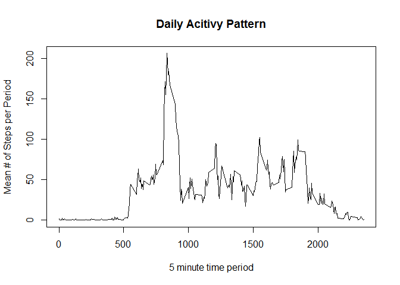
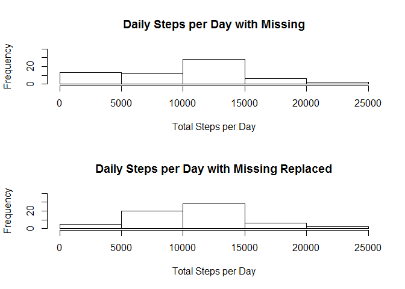
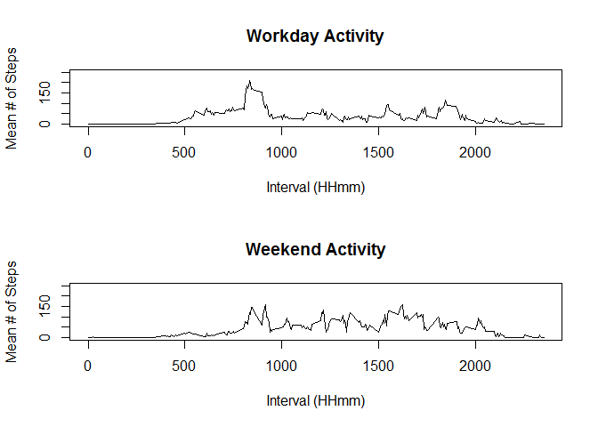

Reproducible Research 1
=======================

    library(plyr)

Load the raw data..

    actData <- read.csv('e:/ReproduceResearch/activity.csv',header=T,sep=',')

Collapse the 5 minute interval data into daily totals.

    dailyData <- ddply(actData, c('date'),summarize, dailySteps=sum(steps,na.rm=T))

What is the mean number of steps taken per day?
-----------------------------------------------

    hist(dailyData$dailySteps,main='Daily Steps per Day',xlab='Total Steps per Day',
          ylim=range(0:30))

    summary(dailyData$dailySteps)

    ##    Min. 1st Qu.  Median    Mean 3rd Qu.    Max. 
    ##       0    6778   10400    9354   12810   21190

What is the average daily activity pattern?
-------------------------------------------

Calculate the average number of steps for each 5 minute intervarl over
the 61 days of data.

    minuteData <- ddply(actData,c('interval'),summarize,meanSteps=mean(steps,na.rm=T))

Plot the daily activity pattern and show which period was the most
active.

    plot(minuteData$interval,minuteData$meanSteps,type='l',xlab='5 minute time period',
          ylab='Mean # of Steps per Period', main="Daily Acitivy Pattern")

Find the most active period during the day.

    minuteData[which.max(minuteData$meanSteps),]

    ##     interval meanSteps
    ## 104      835  206.1698

How much data is missing?
-------------------------

    sum(is.na(actData$steps))

    ## [1] 2304

Replace the missing interval data with the mean number of steps for that interval
---------------------------------------------------------------------------------

    ad2 <- actData
    for (k in 1:length(ad2$steps)) {
          if (is.na(ad2$steps[k])) {
                iTime <- (ad2$interval[k] + 5) / 5
                ad2$steps[k]  <- minuteData$meanSteps[iTime]
          }
    }

Find the new daily total number of steps taken.

    dd2 <- ddply(ad2, c('date'),summarize, dailySteps=sum(steps,na.rm=T))

Compare the two steps of data.

    par(mfcol=c(2,1))
    hist(dailyData$dailySteps,main='Daily Steps per Day with Missing',xlab='Total Steps per Day',
          ylim=range(0:40),ylab='Frequency')
    hist(dd2$dailySteps,main='Daily Steps per Day with Missing Replaced',xlab='Total Steps per Day',
          ylim=range(0:40))

Are there differences in activity patterns between weekdays and weekends?
-------------------------------------------------------------------------

Add day name to the orginal data set.

    ad2$dayName <- weekdays(as.Date(ad2$date))

Determine if day falls on the weekend or not.

    for (k in 1:length(ad2$date)) {
          if (ad2$dayName[k] == 'Sunday' | ad2$dayName[k] == 'Saturday') {
                ad2$dayType[k] <- "Weekend"
          } 
          else {
                ad2$dayType[k] <- "Workday"
          }
    }

Split off Monday - Friday.

    work <- subset(ad2,dayType=="Workday")
    workAct <- ddply(work,c('interval'),summarize,meanSteps=mean(steps,na.rm=T))

Split off the Weekend.

    weekend <- subset(ad2,dayType=="Weekend")    
    weekendAct <- ddply(weekend,c('interval'),summarize,meanSteps=mean(steps,na.rm=T))

Compare the activity patterns between weekdays and weekends.

    par(mfcol = c(2,1))      

    with(workAct,plot(interval,meanSteps,type='l',main='Workday Activity',
                      xlab='Interval (HHmm)',
                      ylab='Mean # of Steps', ylim=range(0:250))
         )
         
    with(weekendAct,plot(interval,meanSteps,type='l',main='Weekend Activity',
                         xlab='Interval (HHmm)',
                         ylab='Mean # of Steps', ylim = range(0:250))
         )                       

